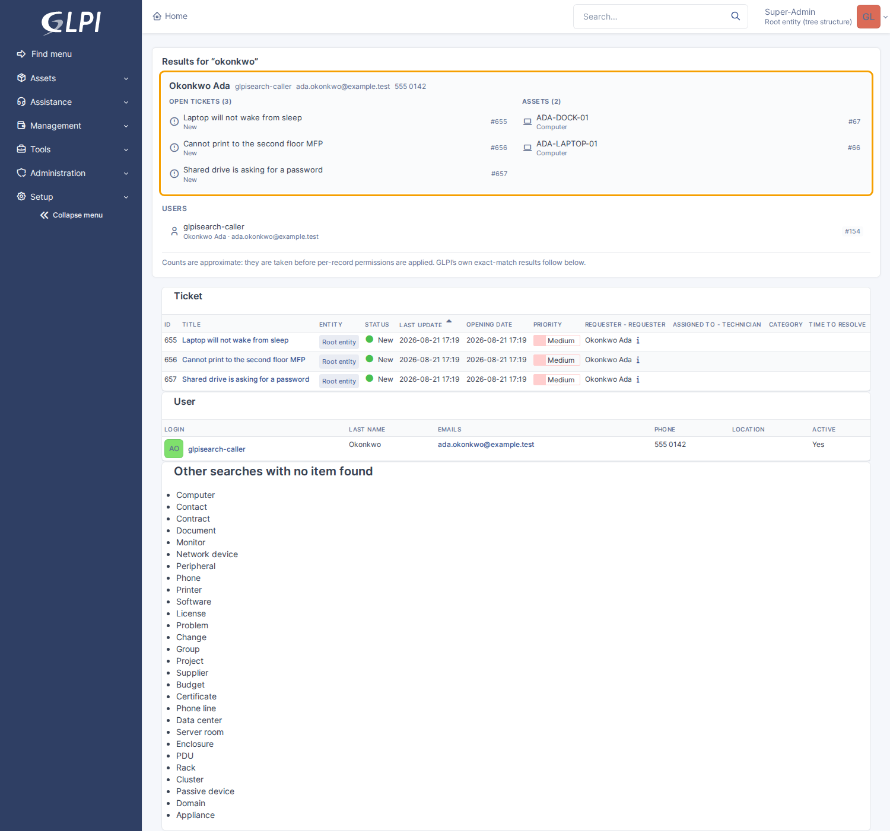
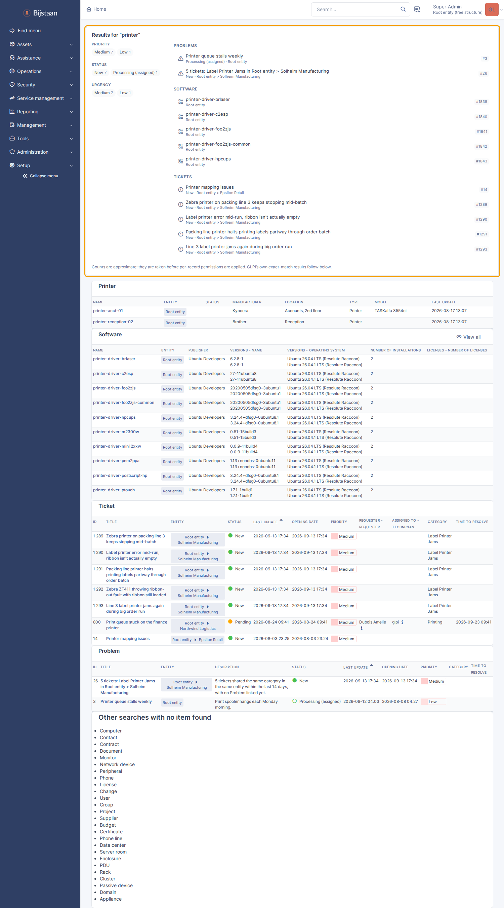
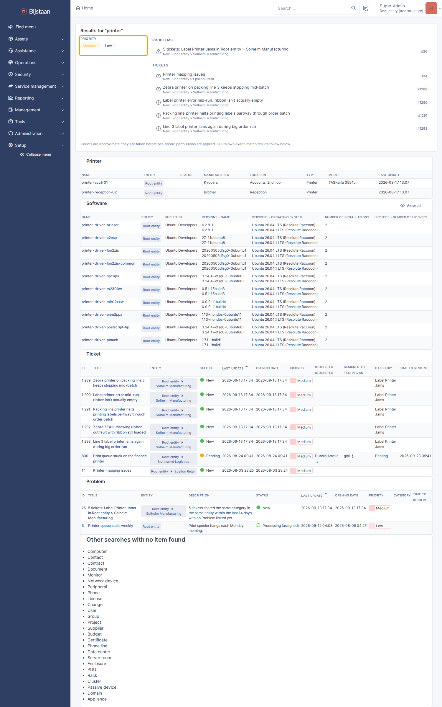

# GLPI Search

Typo-tolerant search over GLPI 11's records, backed by
[Meilisearch](https://www.meilisearch.com/).

GLPI's own search is exact-match SQL. It is precise, respects every right the
profile system defines, and cannot find `Printre`. This plugin puts an inverted
index in front of it: typos tolerated, matching from the first keystroke,
answers in single-digit milliseconds.

It does not become the authority on who may see what. Meilisearch filters on
entity because that is cheap and removes almost everything; GLPI is then asked
about every survivor by the same method the record's own page calls.

Requires a Meilisearch server. No dependency outside GLPI's vendor tree — the
client is a few hundred lines of Guzzle, not an SDK.


## Features

- **Typo tolerance.** `priner`, `prnter` and `printr` all find the printer
  ticket. Tuned per attribute: prose gets tolerance, identifiers do not, since a
  serial number one character out is a different machine.

  

- **Prefix matching.** `ubunt` matches `ubuntu-desktop-minimal` on the second
  keystroke, with no trailing wildcard anywhere in the code.
- **One index per itemtype**, searched together in a single round trip.
  `searchableAttributes` is an ordered list, and the field that best identifies a
  ticket is not the one that identifies a computer.
- **The whole ticket.** Followups, tasks and solutions are indexed with it — on
  the instance this was built against, eight times as much text as the titles and
  descriptions together. Private followups and tasks are kept in separate
  attributes and searched only by sessions holding the rights to read them.
- **Related records.** A ticket carries the names of its category, location,
  requester and assignee, so "sarah chen" finds her ticket and "hardware" finds
  everything filed under it. Users carry their email addresses.
- **Facets** derived automatically from whatever a type points at: counts per
  status, category, priority, assignee, location. Filter with or without a query.
- **Everything, optionally.** One switch widens the default list to every
  itemtype with a table and a name, plugin types included. Measured on the dev
  instance: 81 types, 5,019 documents, 21MB, full rebuild in 36 seconds. A query
  across 81 indexes takes 84–177ms against 8–12ms across six, so `index_all` buys
  reachability rather than speed.
- **Two surfaces.** GLPI's header search box answers as you type, and
  `glpipalette` takes its record results from here when both are installed.
- **Hybrid semantic search** with no configuration here — see below.
- **`search_everything`** read-only tool for `glpiai`.

## Keeping the index in step

GLPI's item hooks write one row to a queue table and return. They do not talk to
Meilisearch or build a document: a technician saving a ticket must not wait on a
search engine, and a search engine that is down must not stop them saving.

A cron task drains the queue in batches. The whole lifecycle is covered —
created, changed, trashed, restored, purged — and a trashed record leaves the
index, because GLPI's own search stops showing it.

The failure posture is opposite on each side:

| | On a Meilisearch it cannot reach |
|---|---|
| **Searching** | Returns nothing, reports `degraded`, and the caller falls back to GLPI's own search. Slower results, never no results |
| **Indexing** | Says so and leaves the queue alone. A cron that quietly indexes nothing reports success while the index rots |

## Install

```bash
# from the GLPI root — the directory must be named for the plugin key,
# which is not the repository name
git clone https://github.com/bijstaan/glpi-search.git plugins/glpisearch
php bin/console plugin:install -u glpi glpisearch
php bin/console plugin:activate glpisearch
```

Then **Setup → Plugins → Search**: point it at Meilisearch, tick the itemtypes,
press **Rebuild**. The queue fills immediately and drains on cron.


Meilisearch is one container:

```bash
docker run -d --name meilisearch -p 7700:7700 \
  -e MEILI_MASTER_KEY=a-development-key \
  getmeili/meilisearch:v1.53
# URL      http://meilisearch:7700   (as GLPI reaches it)
# API key  the master key you set above
```

That key is a development convenience. Production wants a real key and a
Meilisearch that is not on a published port.

## Settings worth understanding

- **Candidates per result** (`overfetch`, default 4). How many hits to fetch per
  row shown, before GLPI's rights check thins them. Matters only for users who
  may see a small fraction of what matched; raise it if restricted technicians
  report short result lists.
- **Semantic ratio** (default 0.3). `0.0` is pure keyword, `1.0` pure meaning.
  Start low — keyword results are the ones people can predict. It lives here
  because Meilisearch has no index-level default for it, and is ignored where no
  embedder exists.
- **Index prefix** (default `glpi`). Change only if two GLPI instances share one
  Meilisearch, and drop the old indexes afterwards.

## The caller

Searching a person — when the query matches exactly one, since two would be a
guess — puts their open tickets and assets above the results, with email, phone
and site on one line.



None of it comes from Meilisearch. The id is already known, and what remains is a
handful of targeted lookups: entity-scoped in SQL, then every row put to
`canViewItem()` before it is shown.

## Ranking and synonyms

Two tiebreakers are appended *after* Meilisearch's own ranking rules, never
before: an open record beats a closed one, and among equals the more recently
touched wins. Text relevance still decides — putting recency above it produces a
search that cannot find last year's answer.

Synonyms close a gap typo tolerance cannot: a user says "the VPN is down" and the
ticket says AnyConnect. Rules are editable in the settings page:

```
copier <=> printer, mfp, laserjet     # every word finds every other
vpn => anyconnect                     # one-way, when the reverse would be wrong
```

Bidirectional is usually right, since the technician cannot know which word this
instance happens to have written down.


## Related data is copied, not joined

A ticket's category, location and requester are foreign keys — the requester is
not even that, it is a row in a link table — and none of it is reachable by a
search engine on its own.

Meilisearch has joins (`foreignKeys`, v1.39+). They were measured against this
case and turned down:

| | joins | denormalising |
|---|---|---|
| Hydrate a related record into the result | yes | n/a |
| Filter on a related field (`_foreign()`) | yes | yes |
| **Search the related text** | **no** | yes |
| **Facet on a related field** | **no** | yes |

The two joins cannot do are most of what anyone wants from search over a
helpdesk: find the ticket by the name of the person who raised it, and count
tickets by category. Both need the value in the document, and once it is there a
join adds a second mechanism, an experimental feature flag, one index per
dropdown table, and no referential integrity.

The price of copying is staleness: renaming a category leaves every ticket in it
findable by the old word. The rename hook queues the affected records, bounded at
5,000 per rename so renaming "Hardware" does not enqueue a quarter of a million
rows inside the web request. Past the cap the remainder keep the old name until
the next rebuild, and that is written to the log.

## Facets

Every foreign key a type has becomes a facet, derived from the table rather than
listed anywhere, so an unanticipated type still gets facets. The coded fields —
status, priority, urgency, impact, type — are stored as their labels, which makes
them both searchable and countable.

```php
$facets = [];
$groups = Finder::search('printer', ['Ticket'], 5, $degraded,
    ['status' => ['New'], 'itilcategories' => ['Hardware']], $facets);
// $facets['status'] === ['New' => 12, 'Processing (assigned)' => 4]
```

Selecting a value does not remove the alternatives: each filtered attribute is
counted by a second query that omits its own filter. Values within one attribute
are OR'd, different attributes AND'd, and the visibility filter AND'd over both,
so a facet filter can only narrow what somebody may already see. Unknown
attributes are dropped and every value is quoted, since both halves arrive from
the browser and the same expression carries the entity restriction.

**The counts are approximate.** They come from Meilisearch, before GLPI's
per-record rights check, so a restricted technician can be shown "New (40)" above
twelve rows. Counting after the check would mean loading every matching record on
every keystroke. The entity filter has already been applied, so the gap is only
ever the per-record rights.

## Searching by meaning

There is no switch and no embedder settings in GLPI. If an index has an embedder,
searches against it are hybrid:

```bash
curl -X PATCH "$MEILI/indexes/glpi_ticket/settings" \
  -H "Authorization: Bearer $KEY" -H 'Content-Type: application/json' \
  -d '{"embedders":{"default":{"source":"ollama","url":"http://ollama:11434/api/embeddings","model":"embeddinggemma:latest"}}}'
```

The settings page reports which indexes are hybrid and does not offer to
configure one. An embedder is a model, credentials and a corpus somebody has
already paid to embed; asking again in GLPI would be a second place for it to be
wrong.

Meilisearch will not apply an embedder on its own — a plain query is keyword-only
however well configured the index is, and `hybrid` has to be sent per query,
which is what this plugin does with what it discovers. The lookup is cached for
five minutes.

**One caution.** Meilisearch processes tasks in a single queue. An embedder
pointed at a model that hangs or refuses will wedge that queue on the first
document it tries to embed, and indexing stops for *every* index. Recovering
means cancelling the task and restarting Meilisearch. Test a new embedder against
a small index first.

## The results page

GLPI's global search page gains a panel above its results: the same
typo-tolerant hits, with a facet sidebar whose chips filter as you click them.
Core's exact-match results stay underneath, untouched.





## The header search box

The box in the top bar is core's and stays core's. This plugin attaches in the
browser rather than overriding the template, and the form underneath is
untouched:

- **Enter with a result selected** opens that result.
- **Enter with nothing selected** submits the form, landing on GLPI's own search
  page exactly as before.
- **A failed or unavailable search** closes the dropdown silently, because the
  fallback is one keypress away.

## glpi-ai tool

`search_everything` — the same typo-tolerant index the command palette uses,
across every configured itemtype at once.

glpi-ai's native searches go through GLPI's exact-match SQL, and an exact search
that finds nothing looks exactly like a fact that is not recorded, so a model
paraphrasing a customer's words concludes "there is no such ticket". The tool's
description tells it to reach for this as the second attempt, every time.

Rights are this plugin's own: `Visibility::filterFor()` narrows the query before
it reaches Meilisearch and `Visibility::keep()` re-checks each hit against GLPI
afterwards, both inside `Finder::search()`. The tool adds no opinion of its own.

Meilisearch being unreachable and there being no matches are both an empty
result, and `Finder` distinguishes them, so the tool returns an explicit error
saying nothing was looked at rather than an empty list.

## Tests

```bash
docker compose -p glpi exec glpi sh -c 'cd /var/www/glpi/plugins/glpisearch && tests/run.sh'
```

`tests/search.php` needs a real Meilisearch, because almost everything worth
asserting is about what Meilisearch actually does. A mock would only prove the
plugin sent what it meant to.

The visibility assertion matters most: it creates a technician scoped to one
entity, searches as them, and checks a record from another entity is absent —
then checks the same query as a super-admin and finds it, so an empty index
cannot make the test pass. The private-followup checks work the same way.

```bash
cd tests/browser && SHOT_DIR=../../docs/screenshots node glpisearch-check.js
```

Three things are only true in a browser: the header takeover attaches to core's
own input and must leave the form under it submittable, the results panel has to
land above core's results without disturbing them, and the facet chips have to
narrow the list. It writes the screenshots in this README.

It caught two bugs the CLI suite structurally could not. The endpoint returned
403 on every request after the first, because the fetch omitted
`X-Requested-With` and GLPI's kernel consumed the CSRF token as an ordinary form
post. And selecting a facet made its own chip disappear: filters are counted
after they are applied, so the chosen value collapsed its facet to a single
entry, which the "a facet with one value narrows nothing" rule then hid.

Unticking a type removes its index, not just its place in the search. An index
left behind holds the text of every record it had, including private followups.

## Layout

```
setup.php              hooks and the SECURED_CONFIGS declaration
hook.php               install/uninstall: one queue table, one cron, one right
src/Settings.php       configuration, including the secret round-trip
src/Client.php         the Meilisearch HTTP client
src/Schema.php         what gets indexed, under what name, ranked how
src/Documents.php      one GLPI record, as a Meilisearch document
src/Queue.php          the list of records whose documents are stale
src/Indexer.php        the cron task that drains it
src/Visibility.php     the entity filter, and GLPI's final word
src/Finder.php         the search API every surface calls
front/config.php       the settings page
ajax/search.php        the header box's backend
public/js/search.js    the header takeover
```

## Licence

GPL-3.0-or-later, the same licence as GLPI. The plugin is loaded into GLPI's
process and extends its classes, so it is a derivative work. See
[LICENSE](LICENSE).
